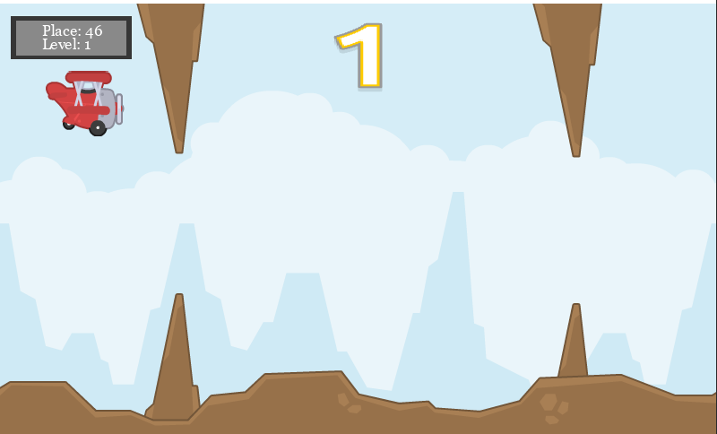

# FLAPPY PLANE
👨‍🏫PROJETO CRIADO PARA O CURSO DE GAME MAKER.

   

## DESCRIÇÃO:
O game é um clone do jogo flappy bird, só que jogado com o player de um avião, e ao invés de tubos, são picos de montanhas que o avião precisará desviar. Conforme os níveis vão aumentando, vai aumentando a velocidade que vem os obstáculos, o quando chegar no nível 9 o player vence.

## IMPORTANDO PARA O GAME MAKER STUDIO:
### MÉTODO 1: IMPORTAR VIA PACOTE DE RECURSOS (.gml):
   - No GameMaker Studio, vá para `Importar Recursos` no menu de Arquivo.
   - Navegue até o arquivo `.gml` ou pacote de recursos que você baixou e selecione-o.
   - Clique em `Importar` para adicionar o conteúdo ao seu projeto.

### MÉTODO 2: COPIAR E COLAR MANUALMENTE:
1. **Copiar o Código e Assets:**
   - Extraia o conteúdo do repositório GitHub (se ainda não o fez) em uma pasta no seu computador.
   - Navegue até a pasta de recursos do seu projeto GameMaker (Em `./CODIGO`).

2. **Adicionar o Conteúdo ao Projeto:**
   - Copie a pasta contendo o código e assets do repositório GitHub.
   - Cole a pasta na pasta de recursos do seu projeto GameMaker. O GameMaker Studio reconhecerá e importará automaticamente os arquivos.

### CONFIGURAR O PROJETO NO GAME MAKER STUDIO:
1. **Abrir a Cena Principal:**
   - No painel `Recursos`, vá para a pasta onde o código e assets foram importados. Procure por uma cena principal, em `./CODIGO/rooms`.
   - Clique duas vezes na cena para abri-la.

2. **Verificar e Ajustar Configurações:**
   - Certifique-se de que todos os scripts, objetos e outros recursos foram importados corretamente.
   - Se houver scripts que precisam de referências, você pode precisar arrastar e soltar esses objetos no `Inspector` para configurar as referências corretamente.

## CREDITOS:
- [PROJETO CRIADO PARA O CURSO DE GAME MAKER](https://github.com/VILHALVA/CURSO-DE-GAME-MAKER)
- [PROJETO EDITADO PELO VILHALVA](https://github.com/VILHALVA)
